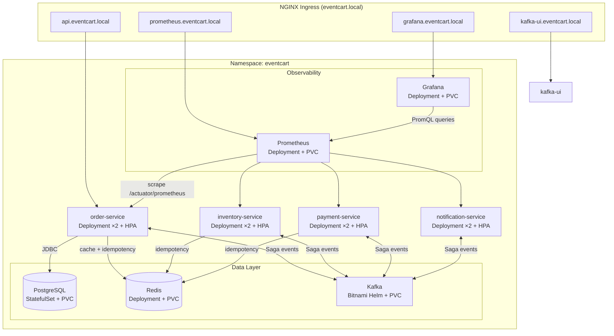
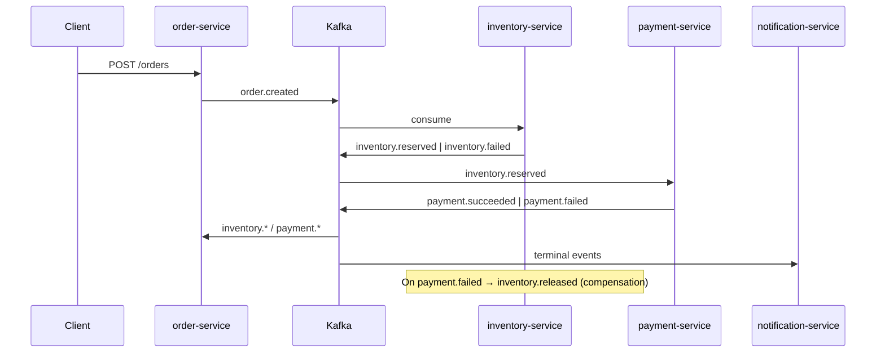
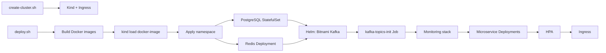

# EventCart Kubernetes Deployment Guide

Production-oriented deployment of the EventCart saga microservices platform on a local **Kind** cluster. This document covers architecture, folder layout, deployment flow, and **every Kubernetes object** with rationale.

---

## Table of Contents

1. [Architecture](#architecture)
2. [Prerequisites](#prerequisites)
3. [Quick Start](#quick-start)
4. [Deployment Flow](#deployment-flow)
5. [Folder Structure](#folder-structure)
6. [Service Discovery & Networking](#service-discovery--networking)
7. [Kubernetes Object Reference](#kubernetes-object-reference)
8. [CI/CD Pipeline](#cicd-pipeline)
9. [Operations Runbook](#operations-runbook)
10. [Production Hardening Checklist](#production-hardening-checklist)

---

## Architecture

EventCart implements a **choreography-based Saga** over Kafka. The order-service is the sole HTTP entry point; inventory, payment, and notification services are Kafka consumers/producers.



### Saga Topic Flow



---

## Prerequisites

| Tool | Version | Purpose |
|------|---------|---------|
| Docker | 24+ | Build images, Kind node runtime |
| Kind | 0.24+ | Local Kubernetes cluster |
| kubectl | 1.29+ | Cluster management |
| Helm | 3.14+ | Bitnami Kafka chart |
| Java | 17 | Local builds (optional) |

**Recommended host resources:** 8 GB RAM, 4 CPU cores (8 microservice pods + data layer).

---

## Quick Start

```bash
# 1. Create Kind cluster with NGINX Ingress
./scripts/kind/create-cluster.sh

# 2. Build images, load into Kind, deploy full stack
./scripts/k8s/deploy.sh

# 3. Verify
curl http://api.eventcart.local/orders/hello
curl -X POST http://api.eventcart.local/orders \
  -H 'Content-Type: application/json' \
  -d '{"items":[{"sku":"SKU-001","quantity":2}],"totalAmount":49.99}'
```

**Dashboards:**

| URL | Credentials |
|-----|-------------|
| http://grafana.eventcart.local | `admin` / `eventcart-grafana-admin` |
| http://prometheus.eventcart.local | — |
| http://kafka-ui.eventcart.local | — |

---

## Deployment Flow



### Ordered dependency rationale

1. **Namespace + quotas** — isolate blast radius before any workload lands.
2. **PostgreSQL + Redis** — microservices fail readiness without backing stores.
3. **Kafka (Helm)** — broker must accept connections before topic Job runs.
4. **Topic Job** — production disables `autoCreateTopics`; topics must exist before consumers start.
5. **Monitoring** — Prometheus RBAC + PVC before scrape targets appear.
6. **Microservices** — rolling update with `maxUnavailable: 0` for zero-downtime.
7. **HPA** — requires metrics-server (built into Kind) and running Deployments.
8. **Ingress** — last, so all backend Services exist when rules are evaluated.

---

## Folder Structure

```
k8s/
├── namespace/           # Isolation boundary + resource governance
│   └── namespace.yaml   # Namespace, ResourceQuota, LimitRange
├── postgres/            # Authoritative order persistence
│   └── statefulset.yaml # StatefulSet, headless Service, Secret, ConfigMap
├── kafka/               # Event backbone
│   ├── helm-values.yaml # Bitnami production-style broker config
│   ├── kafka-topics-job.yaml
│   └── kafka-ui.yaml
├── redis/               # Idempotency + order status cache
│   └── deployment.yaml  # Deployment, PVC, ConfigMap, Service
├── order-service/       # Public API + saga orchestrator
│   └── deployment.yaml  # Deployment, Service, ConfigMap, Secret
├── inventory-service/
├── payment-service/
├── notification-service/
├── monitoring/          # Prometheus + Grafana
│   ├── prometheus.yaml
│   └── grafana.yaml
├── ingress/             # NGINX edge routing
│   └── ingress.yaml
├── hpa/                 # Autoscaling policies
│   └── hpa.yaml
└── kind/
    └── cluster-config.yaml

scripts/
├── kind/create-cluster.sh
└── k8s/deploy.sh

.github/workflows/
└── kubernetes.yml       # CI: build → kind load → deploy → smoke test

EventCart/services/*/Dockerfile   # Multi-stage Java 17 images
```

---

## Service Discovery & Networking

All inter-service communication uses **Kubernetes DNS** (`<service>.<namespace>.svc.cluster.local`). Short names work within the `eventcart` namespace.

| Client | Target | DNS Name | Port |
|--------|--------|----------|------|
| order-service | PostgreSQL | `postgres-0.postgres` | 5432 |
| order-service | Redis | `redis` | 6379 |
| order-service | Kafka | `eventcart-kafka` | 9092 |
| inventory-service | Redis | `redis` | 6379 (DB 1) |
| payment-service | Redis | `redis` | 6379 (DB 2) |
| All consumers | Kafka | `eventcart-kafka` | 9092 |
| Grafana | Prometheus | `prometheus` | 9090 |
| Prometheus | Pod targets | K8s SD via annotations | per-pod |

**No `localhost` references** exist in ConfigMaps — all bootstrap URLs point to cluster Services.

### Redis logical databases

| Service | `SPRING_DATA_REDIS_DATABASE` |
|---------|------------------------------|
| order-service | 0 |
| inventory-service | 1 |
| payment-service | 2 |

---

## Kubernetes Object Reference

Every object below exists for a deliberate production reason.

### `k8s/namespace/`

| Object | Why it exists |
|--------|---------------|
| **Namespace** (`eventcart`) | Logical isolation: RBAC, quotas, DNS, and NetworkPolicy scope. Prevents name collisions with `kube-system`, `ingress-nginx`, etc. |
| **ResourceQuota** | Caps aggregate CPU/memory/PVC/pod count — prevents a runaway deployment from starving the node. Required in multi-tenant clusters. |
| **LimitRange** | Default and max container resources per Pod — ensures every container declares requests/limits even if a manifest omits them. |

### `k8s/postgres/`

| Object | Why it exists |
|--------|---------------|
| **ConfigMap** (`postgres-config`) | Non-sensitive config: database name, user, init SQL. Separates config from secrets for rotation and GitOps. |
| **Secret** (`postgres-secret`) | `POSTGRES_PASSWORD` — never in ConfigMap. In production, replace with Sealed Secrets / ESO / Vault. |
| **Service** (headless, `clusterIP: None`) | Stable network identity per Pod (`postgres-0.postgres.eventcart.svc`). Required by StatefulSet contract. |
| **StatefulSet** | Ordered deploy/scale, stable Pod names, per-replica PVC via `volumeClaimTemplates`. Correct primitive for stateful data. |
| **volumeClaimTemplate** | Each replica gets its own PVC — data survives Pod rescheduling. Uses `ReadWriteOnce` + `standard` StorageClass (Kind default). |
| **livenessProbe** (`pg_isready`) | Restarts hung Postgres processes. |
| **readinessProbe** (`pg_isready`) | Removes Pod from Service endpoints until DB accepts connections — prevents JDBC errors during rollout. |

### `k8s/redis/`

| Object | Why it exists |
|--------|---------------|
| **PersistentVolumeClaim** | AOF persistence (`appendonly yes`) requires durable disk — cache/idempotency keys survive restarts. |
| **ConfigMap** (`redis.conf`) | Production Redis tuning: AOF, memory cap, eviction policy. Decouples config from image. |
| **Deployment** | Redis is a single-primary cache — Deployment (not StatefulSet) suffices for one replica; `Recreate` strategy avoids split-brain during volume attach. |
| **Service** (ClusterIP) | Stable virtual IP for `redis:6379` across Pod restarts. |

### `k8s/kafka/`

| Object | Why it exists |
|--------|---------------|
| **Helm values** (`helm-values.yaml`) | Bitnami chart encodes KRaft mode, persistence, resource limits, and **disabled auto-topic creation** — production baseline. |
| **Job** (`kafka-topics-init`) | Idempotent topic provisioning with explicit partition/replication counts. Runs once after broker is ready. |
| **Deployment** (`kafka-ui`) | Operational visibility into consumer lag, topic config — not on the critical path. |

### Microservices (`k8s/*-service/`)

Each service directory contains four concerns:

| Object | Why it exists |
|--------|---------------|
| **ConfigMap** | Non-sensitive env: Kafka bootstrap, Redis host, ports, Spring profiles, actuator settings. GitOps-friendly; no secret leakage. |
| **Secret** | Credentials (DB password) or placeholder for future API keys. Mounted via `envFrom` — Spring Boot relaxed binding maps to properties. |
| **Service** (ClusterIP) | Stable DNS + load balancing across Pod endpoints. Internal only — not `NodePort`/`LoadBalancer`. |
| **Deployment** | Declarative desired state, rolling updates, replica count. |
| **startupProbe** | Allows slow JVM/Spring Boot boot (up to ~5 min) without liveness killing the Pod. |
| **livenessProbe** (`/actuator/health/liveness`) | Restarts deadlocked JVM. Independent of dependency health. |
| **readinessProbe** (`/actuator/health/readiness`) | Removes Pod from Service endpoints when Kafka/Redis/DB unavailable — critical for rolling updates. |
| **resources.requests/limits** | Scheduler placement (requests) + OOM protection (limits). Required for HPA and production SLOs. |
| **securityContext** (`runAsNonRoot: 1001`) | Matches Dockerfile non-root user — satisfies Pod Security Standards `restricted`. |
| **preStop hook** (`sleep 10`) | Drains in-flight HTTP/Kafka work before SIGTERM — reduces 502s during rollouts. |
| **prometheus.io/* annotations** | Pod annotation-based discovery — Prometheus finds scrape targets without hardcoded IPs. |

#### order-service specifics

- `SPRING_PROFILES_ACTIVE=postgres` — enables JPA persistence (not in-memory).
- `ORDER_DB_URL=jdbc:postgresql://postgres-0.postgres:5432/eventcart_orders` — StatefulSet stable DNS.
- `CORS_ALLOWED_ORIGINS` — explicit allowlist for browser clients via Ingress.

### `k8s/hpa/`

| Object | Why it exists |
|--------|---------------|
| **HorizontalPodAutoscaler** (v2) | Scales replicas on CPU (and memory for order-service). `minReplicas: 2` for HA; `scaleDown.stabilizationWindowSeconds: 300` prevents flapping. Requires metrics-server. |

### `k8s/monitoring/`

| Object | Why it exists |
|--------|---------------|
| **ServiceAccount** (`prometheus`) | Identity for API server calls — principle of least privilege. |
| **ClusterRole** + **ClusterRoleBinding** | Read-only access to Pods/Services/Endpoints for `kubernetes_sd_configs`. Cluster-scoped because Prometheus may watch multiple namespaces in production. |
| **ConfigMap** (`prometheus.yml`) | Scrape config with K8s pod SD + `prometheus.io/scrape` relabel rules. |
| **PVC** (`prometheus-data`) | TSDB retention survives Pod restarts. |
| **Deployment** (Prometheus) | `Recreate` strategy — TSDB is single-writer. |
| **Secret** (`grafana-secret`) | Admin credentials outside ConfigMap. |
| **ConfigMap** (datasources + dashboards) | GitOps-provisioned Grafana — reproducible dashboards across environments. |
| **Deployment** (Grafana) | Visualization layer decoupled from metrics storage. |

### `k8s/ingress/`

| Object | Why it exists |
|--------|---------------|
| **Ingress** (`networking.k8s.io/v1`) | Single north-south entry point. Host-based routing to internal ClusterIP Services. |
| **ingressClassName: nginx** | Binds to NGINX Ingress Controller installed in `ingress-nginx` namespace. |
| **Annotations** (rate limit, timeouts) | Edge policy without application code changes. |

| Host | Backend | Exposure |
|------|---------|----------|
| `api.eventcart.local` | order-service:8080 | Public API |
| `grafana.eventcart.local` | grafana:3000 | Ops |
| `prometheus.eventcart.local` | prometheus:9090 | Ops (add auth in prod) |
| `kafka-ui.eventcart.local` | kafka-ui:8080 | Ops |
| `ops.eventcart.local` | internal services | Debug only |

### `k8s/kind/`

| Object | Why it exists |
|--------|---------------|
| **Kind cluster config** | Multi-node topology (1 control-plane + 2 workers), `ingress-ready` label, host port 80/443 mapping for local Ingress testing. |

### Container images (`EventCart/services/*/Dockerfile`)

| Pattern | Why it exists |
|---------|---------------|
| Multi-stage build | Compile in JDK image, run in slim JRE — smaller attack surface and faster pulls. |
| Non-root user (UID 1001) | Aligns with Pod `securityContext` and PSS restricted. |
| `JAVA_OPTS` container tuning | `-XX:MaxRAMPercentage=75` respects cgroup memory limits. |
| `HEALTHCHECK` | Docker-level health (supplementary to K8s probes). |

---

## CI/CD Pipeline

**Workflow:** `.github/workflows/kubernetes.yml`

```mermaid
flowchart LR
    Push[git push] --> Checkout
    Checkout --> JDK[Setup JDK 17]
    JDK --> Kind[Create Kind cluster]
    Kind --> Ingress[Install NGINX Ingress]
    Ingress --> Build[docker build ×4]
    Build --> Load[kind load docker-image]
    Load --> Deploy[scripts/k8s/deploy.sh]
    Deploy --> Wait[Wait for ready pods]
    Wait --> Smoke[POST /orders smoke test]
```



| Step | Production parallel |
|------|---------------------|
| `docker build` | BuildKit in CI, same Dockerfile as prod |
| `kind load docker-image` | Replace with `docker push` to ECR/GCR + image pull secrets |
| `kubectl apply` | GitOps (Argo CD / Flux) or `helm upgrade --install` |
| Smoke test | Synthetic monitoring / canary analysis |

**Triggers:** push/PR to `main`/`master` when service or `k8s/` paths change; manual `workflow_dispatch`.

---

## Operations Runbook

### Scale a service manually

```bash
kubectl scale deployment/order-service -n eventcart --replicas=3
# HPA will reconcile back to min/max bounds
```

### Rolling restart

```bash
kubectl rollout restart deployment/order-service -n eventcart
kubectl rollout status deployment/order-service -n eventcart
```

### View saga logs

```bash
kubectl logs -n eventcart -l app.kubernetes.io/name=order-service -f --max-log-requests=4
```

### Re-run topic provisioning

```bash
kubectl delete job kafka-topics-init -n eventcart --ignore-not-found
kubectl apply -f k8s/kafka/kafka-topics-job.yaml
```

### Teardown

```bash
kind delete cluster --name eventcart
```

---

## Production Hardening Checklist

| Area | Local (Kind) | Production |
|------|--------------|------------|
| Secrets | Plain K8s Secrets | Sealed Secrets / External Secrets Operator |
| Ingress TLS | HTTP only | cert-manager + Let's Encrypt / internal CA |
| Kafka | 1 broker, RF=1 | 3+ brokers, RF=3, Strimzi or managed MSK |
| PostgreSQL | Single StatefulSet | Managed RDS / Cloud SQL + Flyway migrations |
| Redis | Single instance | Redis Sentinel / ElastiCache |
| Prometheus | Static deploy | Prometheus Operator + ServiceMonitor |
| Network | Open | NetworkPolicy deny-all + explicit allow |
| Image registry | `kind load` | Private registry + image signing (Cosign) |
| PDB | None | PodDisruptionBudget per Deployment |
| DB schema | Hibernate `ddl-auto=update` | Flyway versioned migrations |

---

## Kafka Topics (pre-provisioned)

| Topic | Partitions | Replication | Consumers |
|-------|------------|-------------|-----------|
| `order.created` | 3 | 1 | inventory-service |
| `inventory.reserved` | 3 | 1 | payment-service, order-service |
| `inventory.failed` | 3 | 1 | order-service, notification-service |
| `inventory.released` | 3 | 1 | (compensation, no consumer) |
| `payment.succeeded` | 3 | 1 | order-service, notification-service |
| `payment.failed` | 3 | 1 | order-service, inventory-service, notification-service |

---

## Troubleshooting

| Symptom | Likely cause | Fix |
|---------|--------------|-----|
| `CrashLoopBackOff` on microservice | Kafka/Redis/Postgres not ready | `kubectl get pods -n eventcart`; wait for data layer |
| `ImagePullBackOff` | Image not loaded into Kind | Re-run `deploy.sh` or `kind load docker-image` |
| Ingress 404 | Missing `/etc/hosts` | Run `create-cluster.sh` or add entries manually |
| HPA `<unknown>` | metrics-server missing | Kind includes it; verify: `kubectl top nodes` |
| Order POST 500 | Postgres not reachable | Check `postgres-0` logs and `ORDER_DB_URL` |

---

*This deployment layout mirrors how Canonical and enterprise platform teams structure production Kubernetes repositories: isolated namespaces, StatefulSets for state, Helm for complex operators, annotation-based observability, explicit secrets separation, and CI that validates the full deploy path.*
